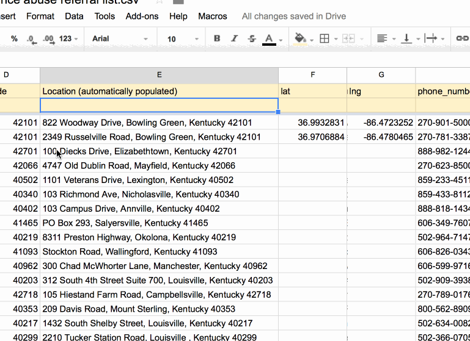

# Get Help Lex  

## How to develop

    npm install
    npm install -g http-server
    npm start

Visit [localhost:8080](http://localhost:8080/) to see the app.

## I want to use this app for my data set.

Great! Head over to our [Getting Started wiki](https://github.com/codeforboston/finda/wiki/Getting-Started)

## I want to help build Finda

Great! See [Developing Finda](https://github.com/codeforboston/finda/wiki/Developing-Finda) on the wiki.

Look in the [waffle board](https://waffle.io/openlexington/finda) for priority issues.

## How to Test

You can run tests once by running: `npm test`

Keep test server running to speed up tests. Start test server:

    npm run test-server

Kick off a test run when the test server is running:

    npm run test-client

## Analytics and feedback

GetHelpLex uses Google Tag Manager to manage Google Analytics as described in the [Unified Analytics repository](https://github.com/laurenancona/unified-analytics).

The feedback form is the [ga-feedback approach](https://github.com/luckyshot/ga-feedback) managed by Google Tag Manager [as described here](http://erikschwartz.net/2016-01-23-google-analytics-events-in-google-tag-manager/).

## Add map coordinates for new facilities

